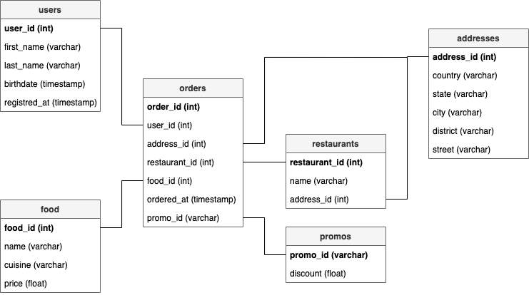

# A food delivery startup

You are working as a data engineer for a food delivery startup, which serves as a middleman between hungry customers and restaurants. You are provided with a multi-dimensional database, which serves well for some purposes, but it is too complex for your colleagues from the marketing department, who want to plan their advertising campaigns based on the data. Having said that, your job is to simplify the database (into star schema), by reducing the dimensionality of the data and introducing new facts and dimensions tables.

## Data

Below you can find a graphical representation of the database that is currently available.


The data is stored in the `app/data` directory. Each CSV file contains a single table with a header row and a comma delimiter.

## Tasks

### Task #1

In the first task, you are asked to read tables from the CSV files into pandas' `DataFrame`s. You should implement the `load_tables(tables_dir_path, tables)` function in the `dims_and_facts.py` module, where `tables_dir_path` is a `Path` object to a directory containing tables in a CSV format and `tables` is a list of table names we want to load (i.e. a list of files we want to load from `tables_dir_path`, but without the `.csv` suffix). The function should parse the list of files and for each file it should return its contents representation as a panda `DataFrame`. The function should return exactly one `DataFrame` for each given file. Each `DataFrame` should have a correct index.

### Task #2

In the second task, you are asked to transform the database and reduce its dimensionality. To do this, you should implement the `reduce_dims(db)` function in the `dims_and_facts.py` module. Given a structure holding all the necessary tables, the function should return a new structure with all the tables transformed to the below schema:




The number and types of columns in each `DataFrame` have to match. You can assume the following types mapping:
* `int` -> `np.int64`,
* `varchar` -> `np.object`,
* `timestamp` -> `np.timestamp[ns]`,
* `float` -> `np.float64`.


### Task #3

The final task is to create an additional table titled `orders_by_meal_type_age_cuisine` by implementing the `create_orders_by_meal_type_age_cuisine_table(db)` function.

The table should have the following structure:

```
order_id (int, index)
meal_type (varchar)
user_age (varchar)
food_cuisine (varchar)
```

where `meal_type` is an enum-like string with the following values:
* `breakfast`, if an order was placed between 6 am and 10 am (both exclusive),
* `lunch`, if an order was placed between 10 am and 4 pm (both inclusive),
* `dinner`, otherwise,

where `user_age` is an enum-like string with the following values:
* `young`, if a user was born in 1995 or later,
* `adult`, if a user was born between 1970 and 1995 (inclusive or exclusive respectively),
* `old`, if a user was born in 1969 or earlier.

The table should be sorted by the `order_id` in ascending order.

## Hints

You shouldn't modify code outside the mentioned methods and the unit tests, just complete the specified features to make the unit tests run as expected.

To execute all unit tests, use:

    pip install -q -e . && python3 setup.py pytest
